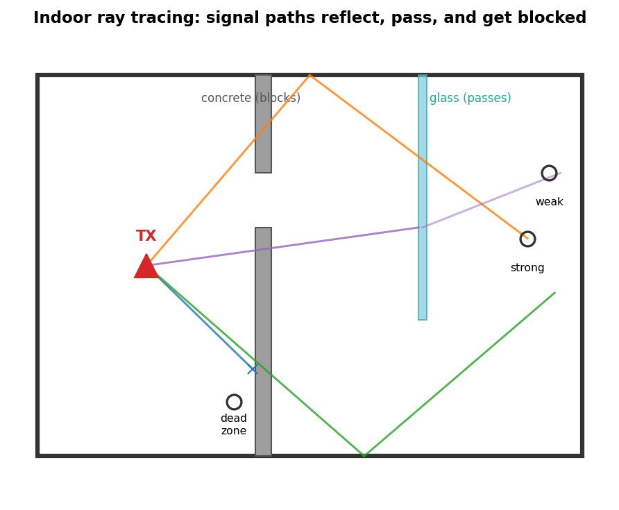
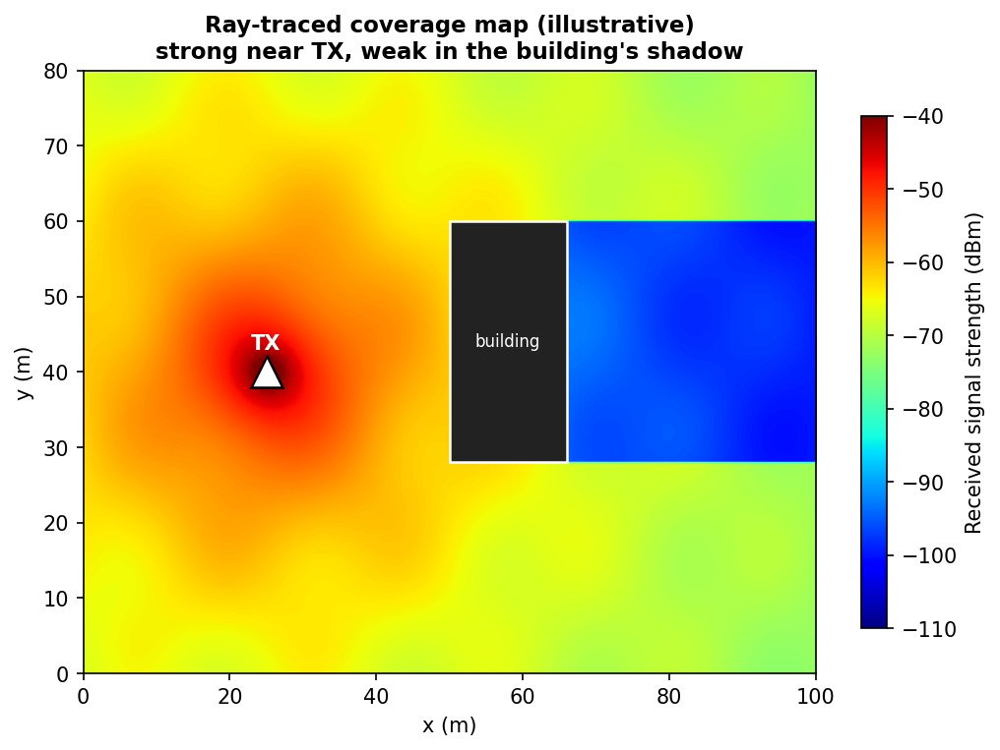
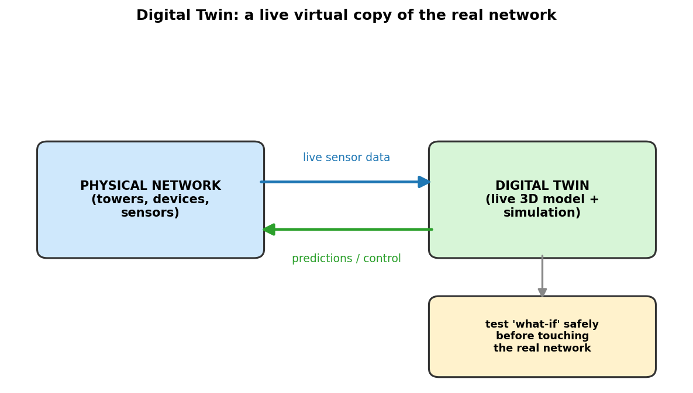

# Day 4: Other Network Simulation Tools

Thursday, 18 June 2026 — 111 Lampe Dr #200 · 11:00 – 11:45 AM

*Tools: SionnaRT · Wireless Insite · ns3-ORAN · MATLAB · Digital Twins*

> Goal: see that **ns-3 is one tool among many**. Different research questions need different simulators — packet-level, radio-wave-level, AI-native, 5G/O-RAN. We'll meet the big ones and *watch them in action*. 🔬

> Format: short explanation → **predict / vote / match-the-tool** → discuss. Answers in ▸ click-to-reveal boxes. 🎥 = short video to play in class.

                    

## 🗳️ Warm-up (3 min)

You've spent two days in **ns-3**, sending packets between nodes. But think about your phone right now:

*  Your Wi-Fi signal has to travel through **walls, furniture, people**. Does ns-3 know your room is made of concrete vs. glass?
*  When you walk behind a wall and your signal drops — what's *physically* happening to the radio waves?

**Pair (30 sec):** ns-3 is great at *"which node sends to which node."* What kind of question can it **not** answer well?

Discussion

ns-3 models the **network/packet** layer brilliantly, but it doesn't trace the actual **radio waves** bouncing off your specific walls. For *"how does this concrete wall weaken my 5G signal?"* you need a different kind of tool — a **ray-tracing** simulator. That's where today's tools come in.

                    

## The Big Picture: One Question, Many Tools 🧰

No single simulator does everything. Researchers pick the tool that matches the **layer** they're studying:

| Tool | What it simulates | Think of it as... |
|---|---|---|
| **ns-3** | Packets & protocols (the network) | "Which message goes where, and when" |
| **Wireless Insite** | Radio waves bouncing off buildings (ray tracing) | "Where does the signal actually reach?" |
| **Sionna / SionnaRT** | Radio waves + **AI**, on a GPU (NVIDIA) | "Ray tracing that an AI can learn from" |
| **ns3-ORAN** | 5G/O-RAN control on top of ns-3 | "Smart, programmable 5G networks" |
| **MATLAB** | Signal math & custom waveforms | "The engineer's math lab" |
| **Digital Twin** (Unreal/Unity/Omniverse) | A live 3D replica of a real system | "A video-game copy of the real network" |

> 💬 **Key idea:** Real research often **chains tools together** — one tool's output feeds the next.

                    

## Ray Tracing: How Radio Waves "See" a Room 📡

Radio waves behave a lot like **light**:

*  They travel in straight lines until they hit something
*  They **reflect** off walls (like a mirror), **pass through** materials (weakened), and **bend** around edges
*  Different materials block them differently — concrete ≠ glass ≠ drywall

**Ray tracing** simulates this by shooting thousands of "rays" from a transmitter and following each bounce — the same technique that makes video-game lighting look real, applied to your Wi-Fi.

### 🔦 Quick Demo (instructor, 1 min)

Shine a flashlight (phone torch) at a mirror, then at a wall, then through a water bottle. *That's ray tracing* — reflection, blocking, refraction. Now imagine doing it for millions of radio rays in a whole building. 🏢

*Figure 1. Indoor ray tracing — rays reflect, pass, and get blocked depending on material. Original illustration. Real tool example: [Remcom — High-Fidelity Ray Tracing, Wireless InSite](https://www.remcom.com/wireless-insite-em-propagation-software/high-fidelity-ray-tracing) (ref [2]).*

> 🎥 **Watch (2 min):** [Wireless InSite — Indoor Propagation Analysis Tutorial (Remcom)](https://www.remcom.com/resources/video/wireless-insite-indoor-propagation-analysis-tutorial) — a real ray-tracing tool predicting indoor coverage.

 

> 💬 **Predict (vote A/B):** A 5G signal hits a **glass office window**. Does more energy (A) bounce off, or (B) pass through, compared to a thick concrete wall?

Answer

**B** — glass lets much more signal **through** than concrete, which mostly **blocks/reflects** it. Predicting *which materials block signal where* is exactly what a ray tracer is for. 👇

                    

## ✍️ Activity: Design the Wi-Fi for THIS Room (8 min)

You're the network engineer. Using ray-tracing intuition, plan the wireless coverage for this classroom.

**In pairs, sketch the room and mark:**

1. 📍 Where would you put the **router/access point**? Why there?
2. 🧱 Which **walls or materials** worry you most (concrete pillar? metal door? glass?)?
3. 👻 Where do you predict a **"dead zone"** (weak signal)?
4. 💡 If one spot is dead, what could you change — move the router? add a second one? different material?

> This is a real research question: *given a building's materials and layout, predict and optimize indoor coverage.* Tools like **Wireless Insite** and **SionnaRT** answer it by ray-tracing the exact materials — instead of guessing, you simulate.

🗣️ **Share-out:** 2–3 pairs show their map. Class votes: whose layout has the fewest dead zones?

                    

## SionnaRT: Ray Tracing Meets AI ⚡

**Sionna** (and **SionnaRT**, its ray-tracing module) is NVIDIA's open-source library:

*  Built on **Python + TensorFlow**, runs on **GPUs** → very fast
*  **Differentiable** ray tracing — meaning an **AI can learn from it** and even optimize the radio environment automatically
*  Open-source on GitHub — anyone can use it

> 🎥 **Watch (2 min):** [Sionna RT — Scene Creation with Blender + OpenStreetMap (NVIDIA)](https://www.youtube.com/watch?v=7xHLDxUaQ7c) — building a real city, then ray-tracing radio in it.

*Figure 2. A ray-traced coverage map (illustrative): strong near the TX, weak in the building's "radio shadow." Original illustration. Real examples: [NVIDIA Sionna RT documentation & gallery](https://nvlabs.github.io/sionna/rt/index.html) (ref [3]).*

> 🔗 The thread to your week: ns-3 (packets) → Wireless Insite / SionnaRT (radio waves) → **ML/AI** (yesterday) → smarter networks. Combining **data (ML)** with **physics/knowledge (ray tracing)** is a hot research direction right now.

                    

## ns3-ORAN: Making ns-3 Speak 5G 📶

**O-RAN** (Open Radio Access Network) is an open standard for building **programmable, multi-vendor 5G** networks — instead of one company's locked box, you mix parts and add "smart controllers." **ns3-ORAN** extends the ns-3 you already know to simulate it.

*  Same ns-3 foundation → you already have a head start
*  Adds the ability to test **AI-driven 5G decisions** (e.g., handing your phone between towers) safely in simulation

> 🎥 **Watch (3 min):** [An Introduction to the Open RAN Concept](https://www.youtube.com/watch?v=-fVHO_WCGF8) · deeper reading: [What is O-RAN? (MathWorks)](https://www.mathworks.com/discovery/o-ran.html)

> ✅ Because it's built on ns-3, the C++/Python skills from this week transfer directly.

                    

## MATLAB: The Engineer's Math Lab 🧮

**MATLAB** is where engineers prototype the **signal math** before it ever touches a network simulator — designing waveforms, antenna patterns, and beams.

*  Fun example: researchers use MATLAB to design **self-bending, self-healing "Airy beams"** — beams that curve around obstacles instead of going straight. 🌈
*  Great for quick math + plots; pairs naturally with ns-3 and Sionna (design in MATLAB → test in the simulator).

> 💬 **Think:** why would a beam that *curves around* an obstacle be useful for wireless?

Idea

If a building or person blocks the straight path, a beam that bends could still reach the receiver — and "self-healing" means it can partly reform after being partly blocked. Useful for reliable coverage in cluttered places.

                    

## Digital Twins: A Living Copy of the Network 🌍

A **Digital Twin (DT)** is a **virtual replica of a real physical system, updated live by real data.** Three ingredients:

1. A real physical thing with sensors streaming data
2. A 3D model of it
3. A live link so the model **acts like** the real thing in real time

Tools for the 3D/visual side: **Unreal Engine, Unity, NVIDIA Omniverse, Blender**. Advanced network twins are even built in **layers** — e.g., a high-level *network* view linked to a low-level *radio/physical* view — so each part stays both accurate and fast.

*Figure 3. Digital Twin — a live virtual copy of the real network: data flows up, predictions/control flow back. Original illustration. Reference architecture: [Network Digital Twin: Concepts & Reference Architecture (IETF NMRG)](https://datatracker.ietf.org/doc/draft-irtf-nmrg-network-digital-twin-arch/) (ref [4]).*

> 💬 **Vote:** What's the difference between a **smart city** and a **digital twin**?

Answer

A **smart city** collects IoT data for analysis but may have *no 3D model*. A **digital twin** always has a **live 3D model** that mirrors the real system. (They overlap, but the 3D + live-sync part makes it a "twin.")

                    

## ✍️ Activity: Match the Tool to the Job (6 min)

In pairs, match each research goal to the **best** tool. (Some need two!)

| # | Research goal | Your pick |
|---|---|---|
| 1 | Test how a routing protocol behaves with 500 nodes | ___ |
| 2 | Predict Wi-Fi dead zones in a concrete building | ___ |
| 3 | Train an AI to optimize a radio environment on a GPU | ___ |
| 4 | Simulate a programmable 5G network controller | ___ |
| 5 | Design a custom self-bending wireless beam | ___ |
| 6 | Build a live 3D replica of a campus network | ___ |

**Tools:** ns-3 · Wireless Insite · SionnaRT · ns3-ORAN · MATLAB · Digital Twin (Unreal/Unity)

Answer Key

1. **ns-3** (packets/protocols at scale)
2. **Wireless Insite** (ray tracing + materials)
3. **SionnaRT** (GPU + differentiable ray tracing for AI)
4. **ns3-ORAN** (5G/O-RAN on ns-3)
5. **MATLAB** (custom waveform/beam math)
6. **Digital Twin** (Unreal/Unity/Omniverse)

                    

## Wrap-up

*  **ns-3** is one tool — the **packet/network** layer. Real research spans many layers.
*  **Ray tracing** (Wireless Insite, SionnaRT) models the actual **radio waves** and **building materials**.
*  **SionnaRT** = ray tracing + **AI + GPU**; **ns3-ORAN** = ns-3 + **5G/O-RAN**; **MATLAB** = the signal-math lab.
*  **Digital Twins** tie it together — a live 3D copy of a real network.
*  The frontier is **combining** these: physics (ray tracing) + data (ML) + live twins → smarter, more reliable networks. 🎓

> 🙋 **Open Q&A:** Ask the instructors anything about doing this kind of research — how you get started, what's hard, what's exciting. This is your chance!

**This afternoon:** Reinforcement-Learning-based simulation examples, then group presentations. The tools you saw today are where these ideas get *used*.

    

---

## 🎥 All Videos (quick links)

*  [Wireless InSite — Indoor Propagation Tutorial (Remcom)](https://www.remcom.com/resources/video/wireless-insite-indoor-propagation-analysis-tutorial)
*  [Wireless InSite — LTE/5G NR Suburban Ray Tracing (Remcom)](https://www.remcom.com/resources/video/lte-and-5g-nr-propagation-in-a-suburban-environment-using-wireless-insite-3d-ray-tracing)
*  [Sionna RT — Scene Creation with Blender + OpenStreetMap (NVIDIA)](https://www.youtube.com/watch?v=7xHLDxUaQ7c)
*  [An Introduction to the Open RAN Concept](https://www.youtube.com/watch?v=-fVHO_WCGF8)

## 📚 References

1. A. Alkhateeb, "DeepMIMO: A Generic Deep Learning Dataset for Millimeter Wave and Massive MIMO Applications," *Proc. Information Theory and Applications Workshop (ITA)*, 2019. (Ray-tracing-based dataset built on Wireless InSite.) [arXiv:1902.06435](https://arxiv.org/abs/1902.06435)
2. Remcom, "Wireless InSite EM Propagation Software — High-Fidelity Ray Tracing." [remcom.com](https://www.remcom.com/wireless-insite-em-propagation-software/high-fidelity-ray-tracing)
3. J. Hoydis et al., "Sionna RT: Differentiable Ray Tracing for Radio Propagation Modeling," NVIDIA, 2023. [research.nvidia.com](https://research.nvidia.com/publication/2023-12_sionna-rt-differentiable-ray-tracing-radio-propagation-modeling) · [Technical report (arXiv)](https://arxiv.org/abs/2504.21719) · [docs](https://nvlabs.github.io/sionna/rt/index.html)
4. IRTF NMRG, "Network Digital Twin: Concepts and Reference Architecture," IETF Internet-Draft. [datatracker.ietf.org](https://datatracker.ietf.org/doc/draft-irtf-nmrg-network-digital-twin-arch/)
5. "Digital twin based DDPG reinforcement learning for sum-rate maximization of AI-UAV communications," *EURASIP Journal on Wireless Communications and Networking*, 2024 (open access). [Article](https://jwcn-eurasipjournals.springeropen.com/articles/10.1186/s13638-024-02386-0)

